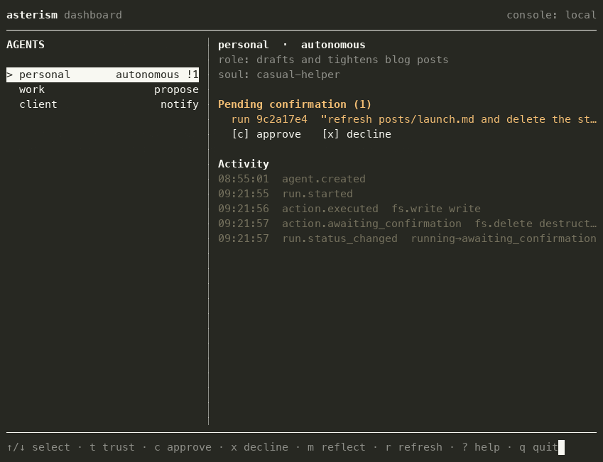
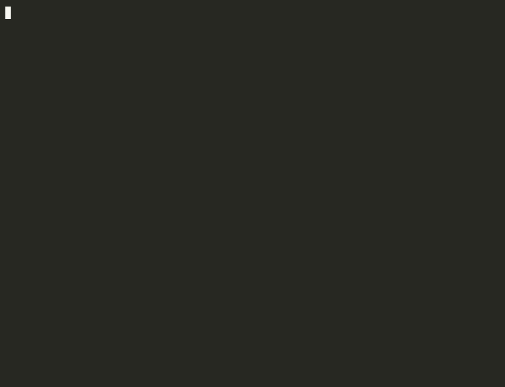

<div align="center">


### Many agents. One runtime. Separate lives.

*Distinct AI agents from one local install — each with its own soul, memory, secrets, skills, workspace, and autonomy. Nothing leaks between them.*

[](https://www.npmjs.com/package/@qmilab/asterism)
[](https://github.com/qmilab/asterism/actions/workflows/docker.yml)
[](LICENSE)
[](#quickstart)
[](#status)

[**Why**](#why) · [**Quickstart**](#quickstart) · [**What you get**](#what-you-get) · [**Docs**](#documentation) · [**Lodestar**](#pairs-with-lodestar)

<br>



<em>The dashboard — every agent and its autonomy in one view, including an autonomous agent paused before a destructive action. <a href="docs/dashboard.md">Watch it live →</a></em>

</div>

---

Run separate AI agents for work, clients, side projects, and experiments from one local install — each with its own **soul, memory, secrets, skills, workspace, event log, and autonomy level**. Agents run alone by default. When they collaborate, they do it through explicit connections — never shared memory or shared credentials.

## Why

Tools like OpenClaw and Hermes are powerful, but they're naturally centered on **one** long-lived agent identity at a time. The moment you want several distinct agents, you end up duplicating runtimes, configs, workspaces — sometimes whole VMs — just to keep their memory, secrets, and credentials apart. You're doing systems administration instead of building.

Asterism makes a distinct agent a first-class thing you create in one command. Each agent is its own body — its own soul, memory, secrets, workspace, and autonomy — and nothing crosses between them unless you say so. A soul is nothing exotic: a small persona file defining an agent's voice, values, and operating style.

The name is the idea. The stars in an asterism aren't bound to each other; they can sit light-years apart and only form a pattern from where you're standing. That's the model: agents that are genuinely separate, organized and navigated as one grouping from a single runtime.

Unlike multi-agent *orchestration* frameworks — which coordinate agents to finish a task and share context freely — Asterism starts with **identity and boundaries**. Collaboration is a later, explicit, permissioned connection, not the default and never implicit shared state.

## Quickstart

New here? The **[getting-started tutorial](./docs/getting-started.md)** is a
~15-minute walk from install to a working agent that writes a file, pauses before
deleting one, and remembers what you approve. The short version:

```bash
npx @qmilab/asterism init     # Node 20+   (Bun: bunx --bun @qmilab/asterism init · Deno: deno run -A npm:@qmilab/asterism init)

# the commands below assume a global install — `npm install -g @qmilab/asterism` —
# or keep prefixing each one with your runner (e.g. `npx @qmilab/asterism new …`)

# create two agents with distinct souls and autonomy
asterism new writer  --soul casual-helper       --trust autonomous
asterism new client  --soul careful-consultant  --trust propose

# scoped secrets and skills — never shared across agents
asterism secrets add client GITHUB_TOKEN ghp_example_token   # value: inline, piped, or from $GITHUB_TOKEN
# a skill is just a markdown file you write
echo "# Blog style: sentence-case headings, active voice" > blog-style.md
asterism skill   add writer blog-style.md

# run them (needs a configured model — see Installation)
asterism run writer "tighten the draft in posts/launch.md"
asterism run client "summarize the meeting and tidy the notes folder"

# inspect what each one knows and did
asterism memory inspect writer
asterism events tail client
```

> **What you'll see** — `writer`'s memory never appears in `client`, and `client`'s `GITHUB_TOKEN` can't be read from `writer`; those boundaries hold the moment the agents exist. The autonomy you set governs the rest — `propose` hands you a plan, while `notify` and `autonomous` act on their own — but before anything **destructive**, even an `autonomous` agent **pauses for your confirmation**. The gate acts on an agent's *tools*: the shipped CLI registers a default catalog of workspace-scoped file tools (`read_file`, `write_file`, `delete_file`) behind it, so with a [configured model](./docs/installation.md#configuring-a-model) an ordinary edit runs under `autonomous` while a deletion pauses — proven end to end in the [five-claims walkthrough](./docs/walkthrough.md).

<div align="center">

<br><em>An <code>autonomous</code> agent writes without asking — then stops dead before a delete until you confirm.</em>
</div>

Prefer a container? The released image is multi-arch and runs natively on Intel/AMD and Apple Silicon — no `--platform` flag:

```bash
docker pull ghcr.io/qmilab/asterism                       # tags: latest · 0.2.1 · 0.2
docker volume create asterism-data                        # state lives in a named volume
docker run --rm -v asterism-data:/data ghcr.io/qmilab/asterism init
```

See [Run in a container](./docs/container.md) for the full setup.

## What you get

| Capability | What it gives you |
|---|---|
| **Distinct agents & souls** | Many agents from one install, each its own identity with its own character. → [Concepts](./docs/concepts.md) |
| **Dialable trust + a destructive-action gate** | `propose` / `notify` / `autonomous` — with a hard stop for your confirmation before anything irreversible, `autonomous` included. → [Trust](./docs/concepts.md#trust-levels) |
| **Reviewable memory** | Typed, scoped per agent, and written only when you approve it. → [Memory](./docs/concepts.md#memory) |
| **Live dashboard** | Watch and steer every agent — autonomy, approvals, memory — in one terminal view. → [Dashboard](./docs/dashboard.md) |
| **Chat channels** | Reach one agent from a Telegram or Discord chat. → [Channels](./docs/channels.md) |
| **Local HTTP endpoint** | Serve one agent over HTTP, with the same guarantees as the CLI. → [HTTP](./docs/http.md) |
| **Run as a service** | Keep an agent running in the background, started by your OS. → [Service](./docs/service.md) |
| **Container image** | Package the same runtime to run on any container host. → [Container](./docs/container.md) |

> **What "separate" means today.** Each agent's memory, secrets, skills, workspace, and event log are scoped to it and enforced everywhere data is read or written — real, tested separation. This is *logical* scoping, **not** OS-level containment: it does not yet claim to safely contain deliberately hostile code. Stronger execution isolation comes in a later phase. See [what isolation means today](./docs/concepts.md#what-isolation-means-today).

## Documentation

Full docs live in [`docs/`](./docs/) ([browse the site](https://qmilab.com/asterism/docs/)):

**Getting started** — [Installation](./docs/installation.md) · [Tutorial](./docs/getting-started.md) · [Concepts](./docs/concepts.md)

**Guides** — [Dashboard](./docs/dashboard.md) · [Chat channels](./docs/channels.md) · [Run as a service](./docs/service.md) · [Run in a container](./docs/container.md) · [Local HTTP endpoint](./docs/http.md)

**Reference** — [Command reference](./docs/commands.md)

**Deep dive** — [Five-claims walkthrough](./docs/walkthrough.md): the separation guarantees proven end to end.

## Continuous, reviewable learning

```bash
asterism reflect writer --review
```

```
Proposed memory writes:
  [convention] This blog uses sentence case in headings.   confidence 0.86
  [procedural] Run a spell pass before saving.             confidence 0.78
  [negative]   Don't rewrite quotes inside blockquotes.    confidence 0.91
Accept? edit? reject?
```

Each agent grows with use — but on its own track, inside its own boundary. Every memory it forms is **typed, scoped to that agent, and yours to approve**; nothing is written silently. Continuity, but plural: many agents growing separately, not one assistant growing around you.

## Pairs with Lodestar

A lodestar is the single star you steer by. An asterism is the grouping you navigate within. Asterism runs your agents and keeps them apart; [Lodestar](https://github.com/qmilab/lodestar) is the layer that makes each one trustworthy — what it knows, believes, and is allowed to do.

## Status

**Phase 1 complete** — latest release **v0.2.1**. The local-first core — distinct agents with per-agent memory, secrets, skills, and workspace; souls and roles; dialable trust with the destructive-action gate; reviewable memory — now joined by a live terminal **dashboard**, **Telegram and Discord** channels, a background **service**, a token-protected **HTTP endpoint**, and a multi-arch **container image** that runs natively on Intel/AMD and Apple Silicon. Still ahead: richer cognition, agent-to-agent collaboration, and stronger execution isolation (today's separation is *logical scoping*, not hardened containment — see [What "separate" means today](#what-you-get)).

## Contributing & security

Contributions are welcome — start with [CONTRIBUTING.md](./CONTRIBUTING.md) and the [Code of Conduct](./CODE_OF_CONDUCT.md). Found a way for one agent to reach another's memory, secrets, or skills? Please report it privately first — see [SECURITY.md](./SECURITY.md).

## License

Apache-2.0 © QMI Lab — see [LICENSE](./LICENSE).
