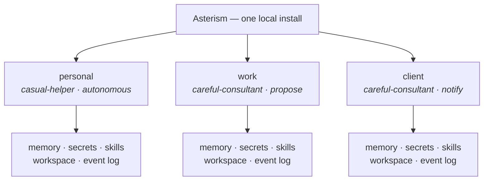

# Concepts

Asterism runs many distinct agents from one local install. The whole design
turns on a single idea:

**The agent is the boundary.**

Each agent is its own identity with its own memory, secrets, skills, workspace,
and autonomy — and nothing crosses between them unless you say so.



One runtime fans out to separate agents; each owns its stores and nothing sits
between them. There is **no shared store and no cross-agent path** — the
separation is enforced everywhere data is read or written. (Today that is
*logical* scoping, not OS-level containment — see
[what isolation means today](#what-isolation-means-today).)

This page explains the nouns you will meet in the commands.

## Agent

An agent is a separate life you create in one command. It has:

- a **name** — the handle you address it by (`writer`, `work`, `personal`);
- a **role** — one line describing what it is responsible for;
- a **soul** — its character and operating style (see below);
- a **workspace** — its own directory on disk, where its skills and files live;
- a **trust level** — how much it may do on its own;
- and its own **memory**, **secrets**, and **event log**.

Two agents created in the same install share none of this. There is no global
store an agent can reach into; a cross-agent read is a bug, not a feature.
Collaboration between agents is a later, explicit, permissioned feature — never
implicit shared state.

## Soul and role

A **soul** is a small persona that shapes how an agent frames itself — its
voice, values, and operating style. It is nothing exotic. Two souls ship
built in:

| Soul | Character |
|---|---|
| `casual-helper` (default) | Warm, direct, informal. Gets to the point and prefers doing over discussing. |
| `careful-consultant` | Measured, precise, conservative. Thinks before acting and surfaces risks plainly. |

You can also point `--soul` at your own Markdown file to define a custom
character. The role is a single sentence — "drafts and tightens blog posts,"
"reviews client contracts" — that says what the agent is for. Both shape the
agent's behavior on every run.

## Trust levels

Trust is how much autonomy an agent has. It is set per agent and is a deliberate
ramp — you dial it up as you come to trust an agent's judgment.

| Level | Behavior |
|---|---|
| `propose` (default) | Never acts on its own. Hands you a plan or diff to run yourself. |
| `notify` | **Acts on its own** inside its workspace, then shows you each action **afterward**. It does *not* ask first. |
| `autonomous` | Acts freely inside its workspace, keeping a reviewable record of everything it did. |

> **`notify` does not ask before acting.** It acts, then notifies. If you want
> approval *before* anything happens, use `propose`. The name is about
> after-the-fact visibility, not a confirmation step.

## The destructive-action gate

There is one rule that overrides trust at every level:

> Before a **destructive** action, an agent pauses for your explicit
> confirmation — *regardless of its trust level* — unless you have specifically
> allowed that capability for it.

An `autonomous` agent will still stop and ask before doing something
irreversible. "Destructive" is an explicit, tested classification, not a
judgment call. It includes, at minimum:

- deleting, overwriting, renaming, or moving your files;
- `git reset --hard`, force-push, branch deletion, destructive rebase;
- reading out or exporting a credential value;
- network calls carrying secrets or private content;
- running package-install or untrusted shell scripts;
- irreversible external actions: payment, email send, public post, production
  deploy.

When the classification is in doubt, it errs toward destructive. This gate is
the difference between "a local database of agents" and agents you can actually
let act on their own.

Confirming is always an explicit, separate act — an inline `[y/N]` in an
interactive run, or [`asterism confirm`](./commands.md#confirm) (and the matching
HTTP endpoint) for a run that paused with no one watching, such as one started over
the network or from a pipe. Either way you approve **only** the action it stopped
on, for that one run — a bounded grant, not a blanket on the capability, so a
further destructive step (even the same kind aimed at a new target) pauses again.

A run that paused without you re-runs from the start when you confirm it — but a
destructive action you have already approved is carried out **at most once**, never
repeated, even if a parallel step interrupted it or its tool reported an ambiguous
error. So you can clear a multi-step run one confirmation at a time without ever
double-charging or double-deleting. Reversible work it had already done (an ordinary
file edit, say) may simply be redone as it picks the task back up.

## Earned autonomy

The gate pauses *every* destructive action by default — but an agent can **earn** the
standing to take one specific capability without that pause. It earns it by a clean
track record: handling that capability cleanly, several times, across different
targets, with nothing declined or failed in between. When it has,
[`asterism trust <agent> --review`](./commands.md#trust) proposes the grant **for your
approval** — earned standing is never automatic, and you grant or decline each.

A grant is narrow and fragile by design. It lets *only that one capability* skip the
pause; it never weakens the classification, never crosses to another capability, and
never carries to another agent. And it is **lost the moment something goes wrong** — a
single declined or failed action on the capability resets it, and it has to be
re-earned. You can revoke a grant yourself at any time, or tune how much evidence an
agent must show before one is proposed. See [`asterism trust`](./commands.md#trust).

## Memory

Each agent accumulates **memory** — typed, scoped to that agent, and yours to
approve. Nothing is ever written silently. Memories have a type:

| Type | What it captures |
|---|---|
| `semantic` | Facts the agent learned. |
| `procedural` | How to do something. |
| `convention` | A rule or style to follow. |
| `negative` | Something to *not* do. |
| `episodic` | A record of a specific past event. |

Memory is reviewed, never assumed — see [Reflection](#reflection). Inspect any
agent's memory with [`asterism memory inspect`](./commands.md#memory-inspect).

Before each run, an agent **recalls** only the most relevant of its memories to
frame the task, so its memory can grow without flooding a run — see
[Recall](#recall).

## Recall

An agent's memory grows with use, but a single run should be framed by the
*relevant* few, not the whole pile. Before each run, an agent **recalls** the most
relevant of its accepted memories and frames only those — capped by a per-agent
**budget**, so memory can grow without flooding the prompt.

Two per-agent knobs tune recall, each scoped to the one agent and never shared:

- **How many** — the recall budget caps how many memories a run may frame; the most
  relevant are kept under the cap.
- **How relevance is judged** — by default a built-in **keyword** ranker that needs
  nothing and makes no network call. You can opt a single agent into ranking its
  memory by **meaning** instead, using a local embeddings endpoint you run yourself
  (for example [Ollama](https://ollama.com)).

Ranking by meaning is **strictly opt-in and off by default**: the default install
pulls no ML and makes no network call for recall, and nothing leaves your machine
unless you turn it on and point it at your own endpoint. Tune both knobs with
[`asterism config`](./commands.md#tuning-recall).

## Standing objectives

Memory is what an agent has *learned*; a **standing objective** is what it is
*working toward*. Where a memory is an accumulated lesson recalled when relevant, an
objective is durable, current **purpose** — "keep the launch blog current and
on-brand," "finish the Q3 migration" — that frames **every** run as standing
context, so the agent keeps the goal in view across many runs rather than treating
each task in isolation.

You declare and manage objectives yourself: they start `active` and frame runs until
you mark them `done` or `drop` them. [Reflection](#reflection) can also *propose* an
objective it notices the agent working toward — but a proposed objective is inert
until you accept it. Like memory, an objective is **human-ratified** before it ever
shapes a run. Manage them with [`asterism objective`](./commands.md#objective).

## Working notes

Objectives and memory are *stable* — purpose you set, lessons you approved. But as it
works, an agent also needs a picture of the **current situation**: "the intro is
rewritten, the closing still needs a pass," "the migration is 60% done." That is what
**working notes** are — the agent's own running record, kept as `subject: value`
pairs it writes **itself** as it goes, and superseded in place (re-noting a subject
replaces it; notes don't pile up). They carry context from one run into the next.

This is the one place an agent writes its own framing input without your review, so it
is governed carefully — and framed honestly:

- **Shown and framed as the agent's own _unverified_ notes, never as fact.** A
  reader — human or model — always sees them labelled as the agent's own record,
  distinct from the memory you ratified, so a self-asserted note never reads as
  something you confirmed.
- **Screened and bounded.** Each note is run through the same safety screen as memory
  before it is saved, and an agent keeps only a bounded number of them.
- **Yours to inspect and revert.** Read, correct, or clear any note with
  [`asterism notes`](./commands.md#notes); the agent records and forgets its own as
  it runs.
- **Scoped and non-destructive.** A note is the agent's own state, scoped to it
  alone, and writing or clearing one touches nothing external — so it is never a
  route around the [destructive-action gate](#the-destructive-action-gate).

## Skills

A **skill** is a Markdown file you attach to an agent to teach it something —
a writing style, a checklist, a domain it should know. When you attach one, the
file is **copied into that agent's own workspace**; other agents cannot see it.
Skills frame the agent's runs alongside its role, soul, and memory.

## Secrets

A **secret** (credential) is a private value scoped to one agent — an API token,
a key. It is stored for that agent alone, by reference, and is **never printed
back, written to the event log, or readable by any other agent.** Reading or
exporting a secret's value is classified destructive, so any tool that surfaced
one would first have to clear the
[destructive-action gate](#the-destructive-action-gate) — but the shipped catalog
includes no such tool: secrets are stored scoped, not yet surfaced into a run at all.

## Event log

Every agent keeps an append-only **event log** of its consequential actions: it
was created, its trust changed, a run started, an action executed or was
withheld or paused for confirmation, a memory was recorded or blocked, a
credential was added or removed. The log stores **references, never values** —
you will never find a secret in it. Read it with [`asterism events tail`](./commands.md#events-tail).

The event types you will see:

| Event | Meaning |
|---|---|
| `agent.created` | The agent was created. |
| `agent.trust_changed` | Its trust level was changed. |
| `agent.standing_changed` | A capability's earned standing changed — a grant given or revoked. |
| `agent.setting_changed` | A per-agent setting changed (recall budget, world-fact cap, recall provider, cognition provider/capture, or an earning threshold). |
| `run.started` / `run.status_changed` | A run began / changed status. |
| `run.resumed` | A paused run was confirmed and re-entered, naming the capabilities granted. |
| `run.declined` | A paused run was declined; it ended without the action ever running. |
| `action.executed` | A side-effecting action ran. |
| `action.succeeded` | A side-effecting action completed successfully. |
| `action.withheld` | A side effect was withheld (returned as a plan under `propose`). |
| `action.awaiting_confirmation` | A destructive action paused for confirmation. |
| `memory.recorded` / `memory.blocked` | A memory was saved / refused by the firewall. |
| `memory.reviewed` | A proposed memory was accepted or rejected in review. |
| `objective.added` / `objective.proposed` | A standing objective was declared / proposed by reflection. |
| `objective.reviewed` / `objective.status_changed` | A proposed objective was accepted or rejected / an objective was marked done or dropped. |
| `objective.blocked` | An objective write was refused by the firewall. |
| `world_fact.recorded` / `world_fact.cleared` / `world_fact.blocked` | A working note was set / removed / refused by the firewall. |
| `world_fact.reviewed` | A proposed working note was accepted or rejected. |
| `reflection.proposed` | A scheduled `reflect --propose` queued proposals from a run. |
| `skill.attached` | A skill was attached. |
| `credential.added` / `credential.rotated` / `credential.removed` | A secret changed. |
| `secret.read` | A secret value was read out. *(Reserved — no shipped tool reads a secret into a run, so you won't see this yet.)* |

## Cognition trace

Beyond the event log, an agent can keep a **cognition trace** — an auditable,
tool-by-tool record of what each of its runs did, which you read back with
[`asterism trace`](./commands.md#trace). It is **opt-in and off by default**: you turn
it on for one agent with [`config cognition-provider <agent> lodestar`](./commands.md#config),
and it pairs with [Lodestar](https://github.com/qmilab/lodestar).

Two properties keep it honest. It is **observe-only** — recording a trace never changes
what an agent may do; a destructive action still pauses for the same confirmation. And
it is kept in the install's own storage, **outside the agent's workspace**, so the agent
cannot reach or tamper with its own record. By default the trace records *references
only* — which tool ran, whether it succeeded, how much it returned — never the contents
of a tool's input or output. You can additionally record the **redacted content** each
tool returned ([`config cognition-capture <agent> content`](./commands.md#config)); even
then, input arguments are never kept and common secret shapes are scrubbed — but that
scrub is best-effort, so leave content capture off for an agent that routinely handles
secrets you cannot risk in an audit record.

## Reflection

Agents learn, but on review. **Reflection** looks back over an agent's latest
work and proposes typed memories it might keep:

```
run transcript → proposed typed memories → safety screen → you accept / edit / reject
```

Nothing becomes a real memory without your approval. Every proposal is typed,
attributed to the run it came from, carries a confidence score, and is screened by
a **memory firewall** that flags anything unsafe to remember before you ever see
it. Run it with [`asterism reflect <agent> --review`](./commands.md#reflect). In
this phase reflection proposes only `semantic`, `procedural`, `convention`, and
`negative` memories.

Reflection also proposes **[standing objectives](#standing-objectives)** — durable
purpose it notices the agent working toward — through the very same review gate: a
proposed objective is inert until you accept it, exactly as a proposed memory is. A
single [`reflect --review`](./commands.md#reflect) goes through both, memories first,
then objectives.

You can also let an agent draft proposals **on a schedule** —
[`reflect --propose`](./commands.md#schedule-it-yourself) fills a review pile in
the background for you to go through later. It never accepts anything; an agent
never starts remembering — or taking on an objective — on its own. And it is never
on by default: nothing reflects on a schedule unless you wire it to a timer
yourself.

Reflection is model-generated, so the exact proposals and confidence scores
differ from run to run; the transcripts in these docs are illustrative, not
output you should expect to reproduce verbatim.

## What isolation means today

Asterism leans on the word *boundary*, so it is worth being exact about which
boundary exists today.

**What you get now:** each agent's memory, secrets, skills, workspace, trust
profile, event log, standing objectives, working notes, and the tools available to
a run are **separate** — scoped to that one agent and enforced everywhere data is
read or written, including over the [local HTTP endpoint](./http.md). One agent
cannot read another's memory, resolve another's secret, or address another's runs.
This is real, tested separation.

**What it is not, yet:** this is *logical* separation, not OS-level containment.
Today's boundary is not a microVM, container, or hardened sandbox, and it does
not claim to safely contain deliberately hostile code. In particular, an agent's
**workspace** is its working directory and default scope — not an OS-enforced
filesystem jail. The shipped file tools refuse a path that climbs out of the
workspace (`..`, an absolute path), but that is each tool's own best-effort
check, not OS-level containment — a different or misbehaving tool would not be
physically prevented from writing elsewhere today. What ultimately guards
against irreversible loss is the
[destructive-action gate](#the-destructive-action-gate) — a deletion pauses for
confirmation regardless of trust — not the workspace boundary. Stronger execution
isolation — process, container, and microVM tiers — is planned for a later phase.
Until then, prefer the words *separate* and *scoped* over *sandboxed* when
describing what Asterism does.

That honesty is the point: autonomous agents with persistent memory, tools, and
credentials are a framework-level security problem, and the framework should be
precise about the guarantees it actually makes.
