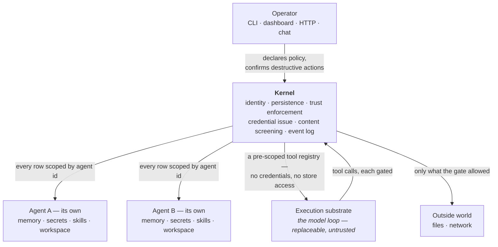

# Threat model

Asterism runs many distinct agents from one install. Each has its own memory,
secrets, skills, workspace, event log, and autonomy level, and nothing leaks
between them. That is a safety claim, and a safety claim you cannot point at a
test for is marketing.

This page is the pointing. It states what the runtime enforces, by what
mechanism, with the test that proves each claim — and, just as carefully, what
it does **not** contain today.

## What this document is

It is written for someone deciding whether to trust an autonomous agent with
their files, their credentials, and their machine. It assumes you are skeptical
and would rather read the limits first.

Every claim below carries an **Evidence** block naming the test file and the
exact test titles that back it. The command in each block is real: clone the
repository and run it, and you will see the same assertions execute. Those
citations are checked by CI on every change — see
[how this page is kept honest](#how-this-page-is-kept-honest), including what
that check does and does not prove.

Three things this document is not. It is not a security *policy* — to report a
vulnerability, see
[SECURITY.md](https://github.com/qmilab/asterism/blob/main/SECURITY.md). It is
not a guarantee of containment against hostile native code; see
[what this boundary is not](#what-this-boundary-is-not). And it is not a
certification: no third party has audited this runtime.

## What is worth protecting

| Asset | Why it matters |
|---|---|
| **Credential values** | An agent may hold API keys. Disclosure is the highest-severity outcome. |
| **Memory** | Memory is replayed into the framing of future runs. A poisoned memory is a *persistent* prompt injection — write it once and every later run inherits it. |
| **The workspace** | Each agent's working directory holds real user files. Deletion and overwrite are irreversible. |
| **The event log** | The audit record. If it can be forged or can be made to carry secret values, nothing else here is verifiable. |
| **Outbound reach** | Network calls that carry a credential leave the machine and cannot be recalled. |
| **The separation itself** | The product *is* the boundary between agents. One agent reaching another's anything is the top-severity class. |

## Trust boundaries

Two words appear throughout, so they are worth fixing now. The **kernel** is the
part of Asterism that owns everything safety depends on: who each agent is, what
is stored for it, which tools it gets, and what is written to its log. The
**execution substrate** is the model loop that actually runs the agent's turn —
deliberately replaceable, and deliberately not trusted.



There is no arrow between Agent A and Agent B, and that is the point: no shared
store sits between them and no path connects them. A [channel](#collaboration-what-crosses-a-channel)
does not add one — it lets the kernel carry one named, curated thing across, and
everything else stays where it was.

Two boundaries carry the weight.

**The agent boundary** is the isolation unit. Every persisted row — memory,
skill, credential, run, event — carries an agent id, and every query requires
one at the storage layer rather than trusting calling code to remember. There is
no global store an agent can reach.

**The kernel/substrate boundary** is what keeps the model loop from being the
security perimeter. The kernel resolves which capabilities an agent holds,
filters them by trust level, and hands the substrate a finished registry. The
substrate receives a name, a schema, and a function. It never holds a
credential, never reaches the store, and cannot widen its own registry.

## Adversary model

Ordered by how seriously the current design takes each one.

| Adversary | Defended today? |
|---|---|
| **A confused or mistaken agent** — the model does something destructive it should have asked about | **Yes.** The primary case. The destructive-action gate is independent of trust level. |
| **Poisoned content reaching memory** — injection arriving through a run, a proposal, or a channel | **Yes**, at the write boundary, plus the structural guarantee that a poisoned memory can only ever reach its own agent. |
| **A compromised or hostile model provider** — output crafted to widen access | **Yes.** The kernel re-enforces every provider-shaped result rather than trusting it. |
| **A curious operator surface** — someone reaching the HTTP endpoint or the chat bot | **Yes.** Both are default-deny. |
| **One agent trying to reach another** | **Yes**, as a logical boundary, enforced in the kernel and at the storage layer. |
| **Hostile native code running inside an agent's own process** | **No.** See [what this boundary is not](#what-this-boundary-is-not). |
| **An adversary with local filesystem access to the install** | **No.** The store and secrets are protected by file permissions, not by encryption at rest. |

## What the kernel enforces

### Each agent is a separate boundary

**One agent cannot read another's credential, memory, events, or capabilities.**
Scoping is enforced at the storage layer — every repository method requires an
agent id and filters on it — so a caller that forgets cannot silently read
across. The same key in two agents resolves to two distinct, isolated values.

> **Evidence** — `bun test packages/core/src/secrets.test.ts`
> - "bob cannot read alice's secret by ref or by key"
> - "same key in two agents stays distinct and isolated"

> **Evidence** — `bun test packages/core/src/memories.test.ts`
> - "a source-run filter never reaches another agent's memory"
> - "a filtered list still requires an agentId"

> **Evidence** — `bun test packages/core/src/events.test.ts`
> - "tail and count are scoped; one agent never sees another's events"

> **Evidence** — `bun test packages/core/src/capability-ownership.test.ts`
> - "a capability one agent owns is unreachable from another agent's run"

### The destructive-action gate

**An action classified destructive never runs without your explicit confirmation,
regardless of the agent's autonomy level**, unless that specific capability has
been allow-listed for that agent. At `notify` and `autonomous` the run stops and
asks; at `propose` it is not taken at all. This is the single rule that separates
"an agent with its own database" from an agent you can leave running.

An unapproved destructive action is a real stop — the tool does not run and the
result is not quietly reported as success. Classification happens in the kernel,
never in the substrate, and escalates on *arguments*: a tool declared as an
ordinary write still trips the gate when what it is about to run is destructive.
A capability declared destructive is never softened in the other direction.

The three autonomy levels differ only in how they treat *ordinary* actions.
`propose` performs no side effect at all — it returns a plan instead, and that
holds even for actions allow-listed for it; reads still run, since reading
changes nothing. `notify` acts inside its own workspace and then surfaces each
action for review — it does **not** ask first, and if you want approval before
anything happens, `propose` is the level that gives it. `autonomous` acts and
records to the event log. The destructive gate above sits on top of all three. See [Concepts → Trust](./concepts.md#trust-levels) for the
fuller account.

Which commands count as destructive is an explicit table, not a judgement call:
every rule in it carries a sample that must trip that exact rule, so the list is
individually tested rather than asserted. What that table does and does not buy
you is [the first known gap](#known-gaps) — it is depth, not the boundary.

> **Evidence** — `bun test packages/core/src/trust.test.ts`
> - "an autonomous agent still pauses on a destructive action"
> - "an unapproved destructive action is a real stop, not a success"
> - "propose withholds destructive even when allow-listed (it executes nothing)"
> - "propose never executes a side effect; reads still run"
> - "argument-level destructive escalation pauses a write-declared shell tool"
> - "a declared-destructive capability is never softened"
> - "every taxonomy rule has a sample and matches its own rule"

### Confinement: what the substrate can reach

**An agent holds only the capabilities the operator declared, and the substrate
receives only what survived the gate.** When nothing is declared, an agent gets
a *named, closed* default set rather than whatever the host happens to offer —
so a capability class added in a later version is never inherited by an agent
that never asked for it. The registry is resolved once per run and snapshotted;
later mutation cannot widen a run already in flight.

The substrate is treated as untrusted and kept swappable, and that separation is
checked mechanically rather than by convention: an automated source scan proves
that nothing outside the one package wrapping it imports it, and a companion test
proves the scan is not vacuously passing.

> **Evidence** — `bun test packages/core/src/trust.test.ts`
> - "confined by default: only allow-listed capabilities are exposed"
> - "the resolved registry snapshots policy; later mutation cannot widen it"

> **Evidence** — `bun test packages/core/src/capability-ownership.test.ts`
> - "the default catalog is a CLOSED set — a host capability outside it is not inherited"

> **Evidence** — `bun test packages/adapter-pi/src/boundary.test.ts`
> - "no package outside adapter-pi imports Pi"
> - "adapter-pi does import Pi — the boundary is real, not vacuous"

### Credentials

**A credential value is never handed to the substrate, never written to the
event log, and never returned by an ordinary read.** What the store issues is a
reference; the value is resolved only through the owning agent's id. The log
records that a disclosure happened, not what was disclosed.

When an agent calls a bound endpoint, the credential lives inside the call's
closure — the tool description the substrate receives carries a name, a schema,
and a function, with no path from any of the three back to the value. The agent
supplies no part of the request: the operator declared the whole URL, so no
agent-authored byte leaves the machine. Such a call is destructive at every
level and can never be auto-approved, and the response is scrubbed of the value
just used before anything else touches it.

> **Evidence** — `bun test packages/core/src/secrets.test.ts`
> - "issue returns a ref, never the value; read resolves it"

> **Evidence** — `bun test packages/core/src/events.test.ts`
> - "a credential value is unreadable across agents and never logged in either"
> - "an executed action logs action.executed with capability + effect, never args"

> **Evidence** — `bun test packages/core/src/credential-capability.test.ts`
> - "a bound endpoint is withheld under `propose` and never calls out"
> - "`autonomous` still pauses — the destructive gate is independent of trust level"
> - "screenEndpointResponse scrubs EVERY occurrence, not just the first"
> - "a model cannot rewrite the credential or URL a human is shown"

### Inbound content

**Anything that will be replayed into a future run is screened before it is
persisted**, because that is what makes injection durable rather than momentary.
Memory writes, standing objectives, working notes, and text shared into a
channel all pass the same screen; a blocked write persists nothing and is
audited by reference, never by content.

Memory recall is a second re-enforcement point. Selecting which memories frame a
run is pluggable, and the kernel does not trust the result: it drops anything
that was not in the candidate set it resolved, frames its own objects rather
than the provider's, and truncates to a budget the provider cannot raise. A
buggy or hostile ranker cannot widen the set or reach across agents.

> **Evidence** — `bun test packages/core/src/firewall.test.ts`
> - "MemoryRepository.create rejects a poisoned write and persists nothing"
> - "every named rule has a sample and that sample trips that rule"

> **Evidence** — `bun test packages/core/src/recall.test.ts`
> - "enforceRecall drops any memory that was not in the candidate set (isolation)"
> - "enforceRecall frames the kernel's own object, not the provider's (no content tamper)"
> - "the default recall budget is frozen so it cannot be poisoned"

### Collaboration: what crosses a channel

Agents run alone by default. Collaboration is an explicit, permissioned channel
between two named agents, and **the channel's mode is the permission** — each
mode authorizes exactly one exchange shape and nothing wider. A channel opened
for one purpose does not authorize another, the grant is directional, and with
no channel the exchange is simply refused.

What crosses is curated and kernel-owned in every mode. Memory rows, secrets,
transcripts, and tools never cross. A memory pull carries a screened extract of
only what the operator already ratified. An artifact exchange carries a
references-only manifest — paths and sizes, not file bytes — with secret-shaped
paths redacted. Shared context flowing *into* an agent is screened first,
because it is the one thing in the prompt the agent did not author. A delegated
tool call is never taken on an agent's own authority: at `notify` and
`autonomous` it pauses for confirmation, under `propose` the callee cannot serve
it at all and it is withheld, and earned autonomy buys out neither.

See [Working together](./collaboration.md) for the modes themselves.

> **Evidence** — `bun test packages/core/src/summary.test.ts`
> - "a pull with no connection is refused — default isolation holds"
> - "a handoff or artifact-only connection does NOT authorize a pull"
> - "only ACCEPTED, ACTIVE memory is eligible — nothing else can cross at any budget"

> **Evidence** — `bun test packages/core/src/artifact.test.ts`
> - "with an artifact-only channel open, each agent's secrets and memory stay its own"
> - "a secret VALUE in a file's contents never crosses — and a secret-shaped PATH is redacted"
> - "a B→A artifact-only connection does NOT authorize an A→B exchange (directional)"

> **Evidence** — `bun test packages/core/src/brief.test.ts`
> - "an injection-shaped brief is blocked, never persisted, and audited on the author's log"

> **Evidence** — `bun test packages/core/src/delegation.test.ts`
> - "a delegated call always pauses — at notify AND at autonomous, and standing cannot buy it out"

### Operator surfaces

**The HTTP endpoint is default-deny.** Every route requires a bearer token,
including on loopback — loopback is not private on a shared machine. A missing
token and a wrong token produce the same 401, and streaming authenticates
identically. A server is bound to one agent and cannot address another; per-agent
tokens are separate files.

**A chat channel is reachable by anyone who knows the bot handle**, so the
boundary there is an explicit allow-list of authorized chat ids, checked before
the kernel is touched at all. An unauthorized chat is refused and no run starts.
Because there is no human at a keyboard, a run that trips the destructive gate
parks and is cleared by an explicit reply — the gate is not weakened for
convenience.

> **Evidence** — `bun test packages/server/src/index.test.ts`
> - "a wrong or malformed token is the same 401 as no token"
> - "SSE authenticates identically — no token is a 401, not a stream"

> **Evidence** — `bun test packages/server/src/console.test.ts`
> - "every route is default-deny: a missing or wrong token is 401"
> - "per-agent reads stay scoped — one agent's data never appears under another"

> **Evidence** — `bun test packages/channels/src/dispatch.test.ts`
> - "an unauthorized chat is refused with its own id and never reaches the kernel"
> - "an authorized chat runs the bound agent — and only that agent"

## What this boundary is not

Everything above is **logical separation enforced by the kernel**: agent-scoped
memory, credentials, skills, workspaces, trust profiles, event logs, and tool
registries.

It is **not** OS-level containment, and we would rather say so than let the word
"boundary" imply it:

- **Agents share a process.** There is no process, container, or virtual-machine
  isolation between them today. Code that can execute arbitrary native
  instructions inside that process is outside what the kernel can enforce — it
  is under the boundary, not behind it.
- **The workspace is a directory, not a jail.** Paths are confined by kernel
  checks, not by the operating system. A capability that reaches the filesystem
  reaches it with the privileges of the user who started Asterism.
- **Data is not encrypted at rest.** The store and the secret store rely on file
  permissions. Anyone who can read the install directory can read both.
- **The runtime cannot vouch for the model.** A hosted provider sees the prompts
  it is sent, including whatever memory framed the run.

If your threat is a deliberately adversarial agent trying to break out of its
own process, this release does not contain it, and reports that depend on
running hostile native code are expected rather than surprising. Stronger
execution isolation is planned work, not a shipped property.

## Known gaps

Stated plainly, because a threat model that lists only its strengths is an
advertisement.

1. **The destructive-command taxonomy is a denylist over arbitrary shell.**
   Equivalent destructive effects can always be re-expressed — a scripting
   language one-liner, an unlisted binary, an encoded payload piped to a shell.
   Safety does not rest on this table. It rests on two other things: purpose-built
   capabilities that declare themselves destructive without any string matching,
   and the allow-list that decides whether a raw shell tool is handed over at
   all. The patterns are depth for the case where one *is* exposed. The source
   says the same thing where the table is defined.

2. **There is no outbound content screen.** Content screening is inbound by
   construction. Outbound safety today rests on the shape of the one
   credential-bearing capability: the agent supplies no bytes, so what leaves is
   exactly what the operator declared. A future capability that let an agent
   author outbound content would need a screen that does not exist yet.

3. **Redaction cannot recognize a secret format it has never seen.** The rules
   that scrub values out of captured tool output are a named table. A novel
   credential format will pass it. This is depth behind the structural guarantee
   that values are not handed out in the first place, not a replacement for it.

4. **Barrier independence is asserted, not audited.** Defense in depth only works
   if the layers fail independently. Nothing yet proves a single bug could not
   defeat two of them at once. This is the gap we would most like a reader to
   attack.

5. **There is no per-capability failure-mode analysis.** Capabilities are
   classified by effect, but there is no systematic table of how each one can
   fail and what its safe state is. That would sharpen classification beyond
   its current granularity.

6. **The evidence check verifies citations, not falsifiability** — see below.

## How this page is kept honest

Every **Evidence** citation on this page is checked in CI, on both supported
runtimes, on every change:

```
bun run check:safety-case
```

The check runs the test suite, reads the list of tests that actually executed,
and fails unless every citation here names a real file and a test that **ran and
passed**. Titles must match exactly. A renamed, deleted, or skipped test breaks
the build rather than silently leaving a dead reference behind.

**What that does not prove.** It verifies that the cited test exists and passes.
It does not verify that the test would *fail* if the invariant it backs were
broken — a test can be weakened without being renamed. That property is
established when the code changes, by deliberately breaking each load-bearing
check and confirming the test goes red, and it is not something CI asserts on
every run. Treat the citations as an index into evidence you can read, not as a
proof that the evidence is sufficient.

We are stating this limit rather than leaving it implied, for the same reason
the gaps above are listed: an evidence section that overclaims its own
verification would fail at exactly the thing this page exists to demonstrate.

## Reporting a vulnerability

Please report privately first, through GitHub's private vulnerability reporting
on the repository's Security tab. Scope, expectations, and what we consider
in-scope are in
[SECURITY.md](https://github.com/qmilab/asterism/blob/main/SECURITY.md).

Anything that breaks a claim on this page is in scope. So is anything that makes
a claim here misleading — if a citation does not support what it is cited for,
we want to know.
